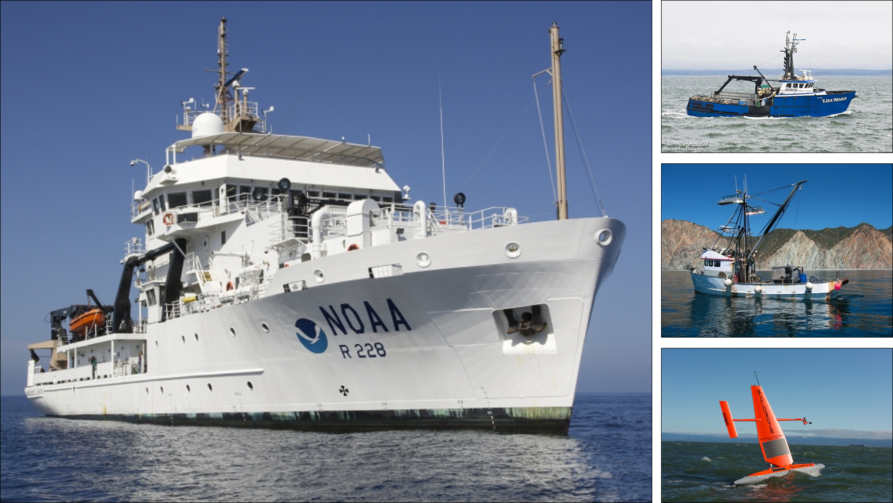

```{r load-libraries,echo=F,error=F,message=F,warning=F}
# Install and load pacman (library management package)
if (!require("pacman")) install.packages("pacman")

# Install and load required packages from CRAN ---------------------------------
pacman::p_load(tidyverse,grid,gridExtra,pander,flextable,lubridate, knitr,here,
               png,devtools,kableExtra,forcats,jpeg,bookdown,bookdownplus,magick,
               mapview)

# Install and load required packages from Github -------------------------------
# surveyR
pacman::p_load_gh("kstierhoff/surveyR")

# set system time zone to GMT
Sys.setenv(tz = "GMT")

# determines method of table generation (whether kable or xtable) for best formatting
doc.type <- knitr::opts_knit$get('rmarkdown.pandoc.to')
if (is.null(doc.type)) {doc.type <- "html"}

# global knitr chunk options
knitr::opts_chunk$set(echo = F, warning = F, message = F,
                      knitr.kable.NA = "-",
                      fig.align = "center",
                      dev = "png", dev.args = list(type = "cairo"))

# Set options for NA values in knitr::kable
options(knitr.kable.NA = '-')

# determine global knitr table format
if (doc.type == "latex") {
  knitr.format <- "latex"
} else {
  knitr.format <- "html" 
}

# global pander options
panderOptions('table.style','rmarkdown'); panderOptions('table.split.table', Inf); panderOptions('digits', 6);
panderOptions('round', 6); panderOptions('keep.trailing.zeros', T); panderOptions('missing', "")

# output options
png.res       <- 150 # dpi for saved PNG images (to reduce file size while at sea)
```

```{r user-input}
# Combine survey regions? -----------------------------------------------------
combine.regions <- TRUE

# Get project name from directory
prj.name <- last(unlist(str_split(here(),"/")))

# Survey information files ------------------------------------------------------
settings.files <- dir(here("Doc/settings"))
prj.settings <- settings.files[str_detect(settings.files, paste0("settings_", prj.name, ".R"))]
source(here("Doc/settings", prj.settings))

# Output files ------------------------------------------------------------------
prj.output <- settings.files[str_detect(settings.files, paste0("output_", prj.name, ".R"))]
source(here("Doc/settings", prj.output))
```

```{r}
# Summarise survey distance (nmi) by vessel
dist.summ <- nasc.summ %>%
  mutate(vessel = case_when(
    str_detect(transect.name, "RL") ~ "RL",
    str_detect(transect.name, "SD") ~ "SD",
    TRUE ~ "Other")) %>% 
  group_by(vessel) %>% 
  summarise(distance = round(sum(distance)))
```

# Background

## Pacific Sardine | Habitat distribution

:::::: {.columns}
::: {.column width="50%"}
{width=100%}
:::

::: {.column width="50%"}
{width=100%}
:::
::::::

<!-- ## Pacific Sardine | Spring and summer habitat distribution -->

<!-- :::::: {.columns} -->
<!-- ::: {.column width="40%"} -->

<!-- - Spring (shaded) and summer (hatched) potential habitat -->
<!-- - Spring (dotted) and summer (dashed) 0.2 mg m^-3^ chl-a isoline -->

<!-- ::: -->

<!-- ::: {.column width="60%"} -->
<!-- {width=100%} -->
<!-- ::: -->
<!-- :::::: -->

<!-- ## Pacific Sardine | Potential habitat -->

<!-- {width=100%} -->

# Methods

## Survey Plan

{width=100%}

## Survey vessels  

{width=100%}

## Target strength calculations

The following equations for $TS_{38\mathrm{kHz}}$ were used in this analysis:  

<br>

$\text{P. Sardine: } TS_{\mathrm{38kHz}} = -14.90 \times (\log_{10} (L_T) - 13.21$

$\text{P. Herring: }TS_{\mathrm{38kHz}} = -11.97 \times (\log_{10} (L_T) - 11.58561$

$\text{N. Anchovy: }TS_{\mathrm{38kHz}} = -13.87 \times (\log_{10} (L_T) - 11.797$

$\text{Mackerels: } TS_{\mathrm{38kHz}} = -15.44 \times (\log_{10} (L_T) - 7.75$  

<br>

where the units for total length ($L_T$) is cm and $TS$ is dB re 1 m^2^ kg^-1^.

## Post-stratification


## Post-stratification

:::::: {.columns}
::: {.column width="40%"}

- a) Acoustic interval cluster assignment
- b) Proportion of CPS in trawl clusters

:::

::: {.column width="60%"}

{width=100%}

:::
::::::

## Backscatter, Eggs, and Acoustic Proportion

{width=100%}

# Results

## Sampling Effort

```{r}
survey.das <- n_distinct(c(unique(date(nasc.summ$start)), unique(date(nasc.summ$end))))
```

:::::: {.columns}
::: {.column width="40%"}

- `r survey.das` DAS between `r format(ymd(erddap.survey.start),"%d %B")` and `r format(ymd(erddap.survey.end),"%d %B %Y")`
- `r sum(str_detect(nasc.summ$transect.name, survey.vessel.primary))` transects
- `r dist.summ$distance[dist.summ$vessel == survey.vessel.primary]` nmi  

:::

::: {.column width="60%"}

{width=100%}

:::
::::::

# All CPS

```{r biomass-table-all,results='asis'}
# Configure bootstrap estimate tables
be.table <- be  %>%
  rename(Name = Species,
         Number           = Stratum,
         Transects        = nTransects,
         Clusters         = nClusters,
         Individuals      = nIndiv,
         Mean             = Biomass,
         SD               = biomass.sd,
         CV               = biomass.cv,
         "CI(Upper)"     = lower.ci.B,
         "CI(Lower)"     = upper.ci.B) %>% 
  mutate(Region = "Core") %>%
  select(Name, Stock, Region, everything(), -SD)

be.table.os <- be.os  %>%
  rename(Name = Species,
         Number           = Stratum,
         Transects        = nTransects,
         Clusters         = nClusters,
         Individuals      = nIndiv,
         Mean             = Biomass,
         SD               = biomass.sd,
         CV               = biomass.cv,
         "CI(Upper)"     = lower.ci.B,
         "CI(Lower)"     = upper.ci.B) %>% 
  mutate(Region = "Offshore") %>%
  select(Name, Stock, Region, everything(), -SD) 

be.table.ns <- be.ns  %>%
  rename(Name = Species,
         Number           = Stratum,
         Transects        = nTransects,
         Clusters         = nClusters,
         Individuals      = nIndiv,
         Mean             = Biomass,
         SD               = biomass.sd,
         CV               = biomass.cv,
         "CI(Upper)"     = lower.ci.B,
         "CI(Lower)"     = upper.ci.B) %>% 
  mutate(Region = "Nearshore") %>%
  select(Name, Stock, Region, everything(), -SD)

be.table.nse <- be.nse  %>%
  rename(Name = Species,
         Number           = Stratum,
         Transects        = nTransects,
         Clusters         = nClusters,
         Individuals      = nIndiv,
         Mean             = Biomass,
         SD               = biomass.sd,
         CV               = biomass.cv,
         "CI(Upper)"     = lower.ci.B,
         "CI(Lower)"     = upper.ci.B) %>% 
  mutate(Region = "NSE") %>%
  select(Name, Stock, Region, everything(), -SD)

if (combine.regions) {
  be.table.all <- be.table %>% 
    bind_rows(be.table.ns) %>% 
    arrange(Name, Stock, Region)
    
} else {
  be.table.all <- be.table
}
```  

## All CPS | All Strata (Core)

```{r biomass-all-strata}
num_keys <- c("Area","Distance","Individuals","Mean","CI(Lower)","CI(Upper)")

regulartable(filter(be.table.all, Region == "Core")) %>% 
  merge_v(j = c("Name")) %>% 
  italic(j = 1) %>%
  bold(~ Number == "All", bold = TRUE) %>% 
  set_formatter(Area         = function(x) sprintf("%.0f", x),
                Distance     = function(x) sprintf("%.0f", x),
                Individuals  = function(x) sprintf("%.0f", x),
                Mean         = function(x) sprintf("%.0f", x),
                Distance     = function(x) sprintf("%.0f", x),
                "CI(Lower)"  = function(x) sprintf("%.0f", x),
                "CI(Upper)"  = function(x) sprintf("%.0f", x),
                CV           = function(x) sprintf("%.0f", x)) %>%
  add_header(Name  = "",
             Stock    = "",
             Region   = "",
             Number   = "Stratum", Area = "Stratum", Transects = "Stratum", Distance = "Stratum",
             Clusters = "Trawl", Individuals = "Trawl",
             Mean     = "Biomass", "CI(Lower)" = "Biomass", "CI(Upper)" = "Biomass",
             CV       = "Biomass") %>% 
  merge_h(part = "header") %>%
  theme_box() %>%
  bg(bg = c("#0691C9"), part = "header") %>% 
  bg(bg = c("#D0ECFA"), ~ Number == "All") %>%
  color(color = "white", part = "header") %>% 
  align(align = "center", part = "header") %>%
  colformat_num(col_keys = num_keys, big.mark = ",", digits = 0, na_str = "-") %>% 
  autofit()
```

## All CPS | All Strata (Nearshore)

```{r biomass-all-strata-ns}
num_keys <- c("Area","Distance","Individuals","Mean","CI(Lower)","CI(Upper)")

regulartable(filter(be.table.all, Region == "Nearshore")) %>% 
  merge_v(j = c("Name")) %>% 
  italic(j = 1) %>%
  bold(~ Number == "All", bold = TRUE) %>% 
  set_formatter(Area         = function(x) sprintf("%.0f", x),
                Distance     = function(x) sprintf("%.0f", x),
                Individuals  = function(x) sprintf("%.0f", x),
                Mean         = function(x) sprintf("%.0f", x),
                Distance     = function(x) sprintf("%.0f", x),
                "CI(Lower)"  = function(x) sprintf("%.0f", x),
                "CI(Upper)"  = function(x) sprintf("%.0f", x),
                CV           = function(x) sprintf("%.0f", x)) %>%
  add_header(Name  = "",
             Stock    = "",
             Region   = "",
             Number   = "Stratum", Area = "Stratum", Transects = "Stratum", Distance = "Stratum",
             Clusters = "Trawl", Individuals = "Trawl",
             Mean     = "Biomass", "CI(Lower)" = "Biomass", "CI(Upper)" = "Biomass",
             CV       = "Biomass") %>% 
  merge_h(part = "header") %>%
  theme_box() %>%
  bg(bg = c("#0691C9"), part = "header") %>% 
  bg(bg = c("#D0ECFA"), ~ Number == "All") %>%
  color(color = "white", part = "header") %>% 
  align(align = "center", part = "header") %>%
  colformat_num(col_keys = num_keys, big.mark = ",", digits = 0, na_str = "-") %>% 
  autofit()
```

## All CPS | Summary

```{r biomass-summary}
be.table.sub <- be.table.all %>% 
  filter(Number == "All") %>% 
  select(-Number)

regulartable(be.table.sub) %>% 
  merge_v(j = c("Name")) %>% 
  italic(j = 1) %>%
  set_formatter(Area         = function(x) sprintf("%.0f", x),
                Distance     = function(x) sprintf("%.0f", x),
                Individuals  = function(x) sprintf("%.0f", x),
                Mean         = function(x) sprintf("%.0f", x),
                Distance     = function(x) sprintf("%.0f", x),
                "CI(Lower)"  = function(x) sprintf("%.0f", x),
                "CI(Upper)"  = function(x) sprintf("%.0f", x),
                CV           = function(x) sprintf("%.0f", x)) %>%
  add_header(Name  = "",
             Stock    = "",
             Region   = "",
             Area = "Stratum", Transects = "Stratum", Distance = "Stratum",
             Clusters = "Trawl", Individuals = "Trawl",
             Mean     = "Biomass", "CI(Lower)" = "Biomass", "CI(Upper)" = "Biomass",
             CV = "Biomass") %>% 
  merge_h(part = "header") %>%
  theme_box() %>%
  bg(bg = c("#0691C9"), part = "header") %>% 
  color(color = "white", part = "header") %>% 
  align(align = "center", part = "header") %>%
  colformat_num(col_keys = num_keys, big.mark = ",", digits = 0, na_str = "-") %>% 
  autofit()
```

# Northern Anchovy (_Engraulis mordax_)
## N. Anchovy | Northern stock - Biomass

```{r biomass-anch-n}
be.table.sub <- be.table.all %>% 
  filter(Name == "Engraulis mordax", Stock == "Northern") 

regulartable(be.table.sub) %>% 
  merge_v(j = c("Name")) %>% 
  italic(j = 1) %>%
  bold(~ Number == "All", bold = TRUE) %>% 
  set_formatter(Area         = function(x) sprintf("%.0f", x),
                Distance     = function(x) sprintf("%.0f", x),
                Individuals  = function(x) sprintf("%.0f", x),
                Mean         = function(x) sprintf("%.0f", x),
                Distance     = function(x) sprintf("%.0f", x),
                "CI(Lower)"  = function(x) sprintf("%.0f", x),
                "CI(Upper)"  = function(x) sprintf("%.0f", x),
                CV           = function(x) sprintf("%.0f", x)) %>%
  add_header(Name  = "",
             Stock    = "",
             Region   = "",
             Number   = "Stratum", Area = "Stratum", Transects = "Stratum", Distance = "Stratum",
             Clusters = "Trawl", Individuals = "Trawl",
             Mean     = "Biomass", "CI(Lower)" = "Biomass", "CI(Upper)" = "Biomass",
             CV = "Biomass") %>% 
  merge_h(part = "header") %>%
  theme_box() %>%
  bg(bg = c("#0691C9"), part = "header") %>% 
  bg(bg = c("#D0ECFA"), ~ Number == "All") %>%
  color(color = "white", part = "header") %>% 
  align(align = "center", part = "header") %>%
  colformat_num(col_keys = num_keys, big.mark = ",", digits = 0, na_str = "-") %>% 
  autofit()
```

## NS N. Anchovy | Biomass and length distribution

:::::: {.columns}
::: {.column width="50%"}  

```{r biom-dens-anch-n,out.height='7.5in',fig.pos='H'}
if (combine.regions) {
  if (file.exists(here("Figs/fig_biomass_dens_combo_Engraulis mordax-Northern.png"))) {
    include_graphics(here("Figs/fig_biomass_dens_combo_Engraulis mordax-Northern.png"))  
  } else {
    print("No results for this species/stock.")
  } 
  
} else {
  if (file.exists(here("Figs/fig_biomass_dens_Engraulis mordax-Northern.png"))) {
    include_graphics(here("Figs/fig_biomass_dens_Engraulis mordax-Northern.png"))  
  } else {
    print("No results for this species/stock.")
  }  
}
```

:::

::: {.column width="50%"}  

```{r l-disagg-anch-n,out.height='6in',fig.pos='H'}
if (combine.regions) {
  if (file.exists(here("Figs/fig_L_disagg_combo_Engraulis mordax-Northern.png"))) {
    include_graphics(here("Figs/fig_L_disagg_combo_Engraulis mordax-Northern.png"))  
  } else {
    print("No results for this species/stock.")
  } 
  
} else {
  if (file.exists(here("Figs/fig_L_disagg_Engraulis mordax-Northern.png"))) {
    include_graphics(here("Figs/fig_L_disagg_Engraulis mordax-Northern.png"))  
  } else {
    print("No results for this species/stock.")
  }
}
```
:::
::::::

## N. Anchovy | Central stock - Biomass

```{r biomass-anch-c}
be.table.sub <- be.table.all %>% 
  filter(Name == "Engraulis mordax", Stock == "Central") 

regulartable(be.table.sub) %>% 
  merge_v(j = c("Name")) %>% 
  italic(j = 1) %>%
  bold(~ Number == "All", bold = TRUE) %>% 
  set_formatter(Area         = function(x) sprintf("%.0f", x),
                Distance     = function(x) sprintf("%.0f", x),
                Individuals  = function(x) sprintf("%.0f", x),
                Mean         = function(x) sprintf("%.0f", x),
                Distance     = function(x) sprintf("%.0f", x),
                "CI(Lower)"  = function(x) sprintf("%.0f", x),
                "CI(Upper)"  = function(x) sprintf("%.0f", x),
                CV           = function(x) sprintf("%.0f", x)) %>%
  add_header(Name  = "",
             Stock    = "",
             Region   = "",
             Number   = "Stratum", Area = "Stratum", Transects = "Stratum", Distance = "Stratum",
             Clusters = "Trawl", Individuals = "Trawl",
             Mean     = "Biomass", "CI(Lower)" = "Biomass", "CI(Upper)" = "Biomass",
             CV = "Biomass") %>% 
  merge_h(part = "header") %>%
  theme_box() %>%
  bg(bg = c("#0691C9"), part = "header") %>% 
  bg(bg = c("#D0ECFA"), ~ Number == "All") %>%
  color(color = "white", part = "header") %>% 
  align(align = "center", part = "header") %>%
  colformat_num(col_keys = num_keys, big.mark = ",", digits = 0, na_str = "-") %>% 
  autofit()
```

## CS N. Anchovy | Biomass and length distribution

:::::: {.columns}
::: {.column width="50%"}  

```{r biom-dens-anch-c,out.height='7.5in',fig.pos='H'}
if (combine.regions) {
  if (file.exists(here("Figs/fig_biomass_dens_combo_Engraulis mordax-Central.png"))) {
    include_graphics(here("Figs/fig_biomass_dens_combo_Engraulis mordax-Central.png"))  
  } else {
    print("No results for this species/stock.")
  } 
  
} else {
  if (file.exists(here("Figs/fig_biomass_dens_Engraulis mordax-Central.png"))) {
    include_graphics(here("Figs/fig_biomass_dens_Engraulis mordax-Central.png"))  
  } else {
    print("No results for this species/stock.")
  }  
}
```

:::

::: {.column width="50%"}  

```{r l-disagg-anch-c,out.height='6in',fig.pos='H'}
if (combine.regions) {
  if (file.exists(here("Figs/fig_L_disagg_combo_Engraulis mordax-Central.png"))) {
    include_graphics(here("Figs/fig_L_disagg_combo_Engraulis mordax-Central.png"))  
  } else {
    print("No results for this species/stock.")
  } 
  
} else {
  if (file.exists(here("Figs/fig_L_disagg_Engraulis mordax-Central.png"))) {
    include_graphics(here("Figs/fig_L_disagg_Engraulis mordax-Central.png"))  
  } else {
    print("No results for this species/stock.")
  }
}
```
:::
::::::

## N. Anchovy | % Biomass by Cluster & Length


# Pacific Sardine (_Sardinops sagax_)
## P. Sardine | Northern stock - Biomass

```{r biomass-sar-n}
be.table.sub <- be.table.all %>% 
  filter(Name == "Sardinops sagax", Stock == "Northern") 

regulartable(be.table.sub) %>% 
  merge_v(j = c("Name")) %>% 
  italic(j = 1) %>%
  bold(~ Number == "All", bold = TRUE) %>% 
  set_formatter(Area         = function(x) sprintf("%.0f", x),
                Distance     = function(x) sprintf("%.0f", x),
                Individuals  = function(x) sprintf("%.0f", x),
                Mean         = function(x) sprintf("%.0f", x),
                Distance     = function(x) sprintf("%.0f", x),
                "CI(Lower)"  = function(x) sprintf("%.0f", x),
                "CI(Upper)"  = function(x) sprintf("%.0f", x),
                CV           = function(x) sprintf("%.0f", x)) %>%
  add_header(Name  = "",
             Stock    = "",
             Region   = "",
             Number   = "Stratum", Area = "Stratum", Transects = "Stratum", Distance = "Stratum",
             Clusters = "Trawl", Individuals = "Trawl",
             Mean     = "Biomass", "CI(Lower)" = "Biomass", "CI(Upper)" = "Biomass",
             CV = "Biomass") %>% 
  merge_h(part = "header") %>%
  theme_box() %>%
  bg(bg = c("#0691C9"), part = "header") %>% 
  bg(bg = c("#D0ECFA"), ~ Number == "All") %>%
  color(color = "white", part = "header") %>% 
  align(align = "center", part = "header") %>%
  colformat_num(col_keys = num_keys, big.mark = ",", digits = 0, na_str = "-") %>% 
  autofit()
```

## NS P. Sardine | Biomass and length distribution

:::::: {.columns}
::: {.column width="50%"}  

```{r biom-dens-sar-n,out.height='7.5in',fig.pos='H'}
if (combine.regions) {
  if (file.exists(here("Figs/fig_biomass_dens_combo_Sardinops sagax-Northern.png"))) {
    include_graphics(here("Figs/fig_biomass_dens_combo_Sardinops sagax-Northern.png"))  
  } else {
    print("No results for this species/stock.")
  } 
  
} else {
  if (file.exists(here("Figs/fig_biomass_dens_Sardinops sagax-Northern.png"))) {
    include_graphics(here("Figs/fig_biomass_dens_Sardinops sagax-Northern.png"))  
  } else {
    print("No results for this species/stock.")
  }  
}
```

:::

::: {.column width="50%"}  

```{r l-disagg-sar-n,out.height='6in',fig.pos='H'}
if (combine.regions) {
  if (file.exists(here("Figs/fig_L_disagg_combo_Sardinops sagax-Northern.png"))) {
    include_graphics(here("Figs/fig_L_disagg_combo_Sardinops sagax-Northern.png"))  
  } else {
    print("No results for this species/stock.")
  } 
  
} else {
  if (file.exists(here("Figs/fig_L_disagg_Sardinops sagax-Northern.png"))) {
    include_graphics(here("Figs/fig_L_disagg_Sardinops sagax-Northern.png"))  
  } else {
    print("No results for this species/stock.")
  }
}
```
:::
::::::

## P. Sardine | Southern stock - Biomass

```{r biomass-sar-s}
be.table.sub <- be.table.all %>% 
  filter(Name == "Sardinops sagax", Stock == "Southern") 

regulartable(be.table.sub) %>% 
  merge_v(j = c("Name")) %>% 
  italic(j = 1) %>%
  bold(~ Number == "All", bold = TRUE) %>% 
  set_formatter(Area         = function(x) sprintf("%.0f", x),
                Distance     = function(x) sprintf("%.0f", x),
                Individuals  = function(x) sprintf("%.0f", x),
                Mean         = function(x) sprintf("%.0f", x),
                Distance     = function(x) sprintf("%.0f", x),
                "CI(Lower)"  = function(x) sprintf("%.0f", x),
                "CI(Upper)"  = function(x) sprintf("%.0f", x),
                CV           = function(x) sprintf("%.0f", x)) %>%
  add_header(Name  = "",
             Stock    = "",
             Region   = "",
             Number   = "Stratum", Area = "Stratum", Transects = "Stratum", Distance = "Stratum",
             Clusters = "Trawl", Individuals = "Trawl",
             Mean     = "Biomass", "CI(Lower)" = "Biomass", "CI(Upper)" = "Biomass",
             CV = "Biomass") %>% 
  merge_h(part = "header") %>%
  theme_box() %>%
  bg(bg = c("#0691C9"), part = "header") %>% 
  bg(bg = c("#D0ECFA"), ~ Number == "All") %>%
  color(color = "white", part = "header") %>% 
  align(align = "center", part = "header") %>%
  colformat_num(col_keys = num_keys, big.mark = ",", digits = 0, na_str = "-") %>% 
  autofit()
```


## SS P. Sardine | Biomass and length distribution

:::::: {.columns}
::: {.column width="50%"}  

```{r biom-dens-sar-s,out.height='7.5in',fig.pos='H'}
if (combine.regions) {
  if (file.exists(here("Figs/fig_biomass_dens_combo_Sardinops sagax-Southern.png"))) {
    include_graphics(here("Figs/fig_biomass_dens_combo_Sardinops sagax-Southern.png"))  
  } else {
    print("No results for this species/stock.")
  } 
  
} else {
  if (file.exists(here("Figs/fig_biomass_dens_Sardinops sagax-Southern.png"))) {
    include_graphics(here("Figs/fig_biomass_dens_Sardinops sagax-Southern.png"))  
  } else {
    print("No results for this species/stock.")
  }  
}
```

:::

::: {.column width="50%"}  

```{r l-disagg-sar-s,out.height='6in',fig.pos='H'}
if (combine.regions) {
  if (file.exists(here("Figs/fig_L_disagg_combo_Sardinops sagax-Southern.png"))) {
    include_graphics(here("Figs/fig_L_disagg_combo_Sardinops sagax-Southern.png"))  
  } else {
    print("No results for this species/stock.")
  } 
  
} else {
  if (file.exists(here("Figs/fig_L_disagg_Sardinops sagax-Southern.png"))) {
    include_graphics(here("Figs/fig_L_disagg_Sardinops sagax-Southern.png"))  
  } else {
    print("No results for this species/stock.")
  }
}
```
:::
::::::

## Pacific Sardine | % Biomass by Cluster & Length


# Pacific Mackerel (_Scomber japonicus_)

## Pacific Mackerel - Biomass

```{r biomass-mack}
be.table.sub <- be.table.all %>% 
  filter(Name == "Scomber japonicus", Stock == "All") 

regulartable(be.table.sub) %>% 
  merge_v(j = c("Name")) %>% 
  italic(j = 1) %>%
  bold(~ Number == "All", bold = TRUE) %>% 
  set_formatter(Area         = function(x) sprintf("%.0f", x),
                Distance     = function(x) sprintf("%.0f", x),
                Individuals  = function(x) sprintf("%.0f", x),
                Mean         = function(x) sprintf("%.0f", x),
                Distance     = function(x) sprintf("%.0f", x),
                "CI(Lower)"  = function(x) sprintf("%.0f", x),
                "CI(Upper)"  = function(x) sprintf("%.0f", x),
                CV           = function(x) sprintf("%.0f", x)) %>%
  add_header(Name  = "",
             Stock    = "",
             Region   = "",
             Number   = "Stratum", Area = "Stratum", Transects = "Stratum", Distance = "Stratum",
             Clusters = "Trawl", Individuals = "Trawl",
             Mean     = "Biomass", "CI(Lower)" = "Biomass", "CI(Upper)" = "Biomass",
             CV = "Biomass") %>% 
  merge_h(part = "header") %>%
  theme_box() %>%
  bg(bg = c("#0691C9"), part = "header") %>% 
  bg(bg = c("#D0ECFA"), ~ Number == "All") %>%
  color(color = "white", part = "header") %>% 
  align(align = "center", part = "header") %>%
  colformat_num(col_keys = num_keys, big.mark = ",", digits = 0, na_str = "-") %>% 
  autofit()
```

## Pacific Mackerel | Biomass and length distribution

:::::: {.columns}
::: {.column width="50%"}  

```{r biom-dens-mack,out.height='7.5in',fig.pos='H'}
if (combine.regions) {
  if (file.exists(here("Figs/fig_biomass_dens_combo_Scomber japonicus-All.png"))) {
    include_graphics(here("Figs/fig_biomass_dens_combo_Scomber japonicus-All.png"))  
  } else {
    print("No results for this species/stock.")
  } 
  
} else {
  if (file.exists(here("Figs/fig_biomass_dens_Scomber japonicus-All.png"))) {
    include_graphics(here("Figs/fig_biomass_dens_Scomber japonicus-All.png"))  
  } else {
    print("No results for this species/stock.")
  }  
}
```

:::

::: {.column width="50%"}  

```{r l-disagg-mack,out.height='6in',fig.pos='H'}
if (combine.regions) {
  if (file.exists(here("Figs/fig_L_disagg_combo_Scomber japonicus-All.png"))) {
    include_graphics(here("Figs/fig_L_disagg_combo_Scomber japonicus-All.png"))  
  } else {
    print("No results for this species/stock.")
  } 
  
} else {
  if (file.exists(here("Figs/fig_L_disagg_Scomber japonicus-All.png"))) {
    include_graphics(here("Figs/fig_L_disagg_Scomber japonicus-All.png"))  
  } else {
    print("No results for this species/stock.")
  }
}
```
:::
::::::

## Pacific Mackerel | % Biomass by Cluster & Length


# Jack Mackerel (_Trachurus symmetricus_)

## Jack Mackerel - Biomass

```{r biomass-jack}
be.table.sub <- be.table.all %>% 
  filter(Name == "Trachurus symmetricus", Stock == "All") 

regulartable(be.table.sub) %>% 
  merge_v(j = c("Name")) %>% 
  italic(j = 1) %>%
  bold(~ Number == "All", bold = TRUE) %>% 
  set_formatter(Area         = function(x) sprintf("%.0f", x),
                Distance     = function(x) sprintf("%.0f", x),
                Individuals  = function(x) sprintf("%.0f", x),
                Mean         = function(x) sprintf("%.0f", x),
                Distance     = function(x) sprintf("%.0f", x),
                "CI(Lower)"  = function(x) sprintf("%.0f", x),
                "CI(Upper)"  = function(x) sprintf("%.0f", x),
                CV           = function(x) sprintf("%.0f", x)) %>%
  add_header(Name  = "",
             Stock    = "",
             Region   = "",
             Number   = "Stratum", Area = "Stratum", Transects = "Stratum", Distance = "Stratum",
             Clusters = "Trawl", Individuals = "Trawl",
             Mean     = "Biomass", "CI(Lower)" = "Biomass", "CI(Upper)" = "Biomass",
             CV = "Biomass") %>% 
  merge_h(part = "header") %>%
  theme_box() %>%
  bg(bg = c("#0691C9"), part = "header") %>% 
  bg(bg = c("#D0ECFA"), ~ Number == "All") %>%
  color(color = "white", part = "header") %>% 
  align(align = "center", part = "header") %>%
  colformat_num(col_keys = num_keys, big.mark = ",", digits = 0, na_str = "-") %>% 
  autofit()
```

## Jack Mackerel | Biomass and length distribution

:::::: {.columns}
::: {.column width="50%"}  

```{r biom-dens-jack,out.height='7.5in',fig.pos='H'}
if (combine.regions) {
  if (file.exists(here("Figs/fig_biomass_dens_combo_Trachurus symmetricus-All.png"))) {
    include_graphics(here("Figs/fig_biomass_dens_combo_Trachurus symmetricus-All.png"))  
  } else {
    print("No results for this species/stock.")
  } 
  
} else {
  if (file.exists(here("Figs/fig_biomass_dens_Trachurus symmetricus-All.png"))) {
    include_graphics(here("Figs/fig_biomass_dens_Trachurus symmetricus-All.png"))  
  } else {
    print("No results for this species/stock.")
  }  
}
```

:::

::: {.column width="50%"}  

```{r l-disagg-jack,out.height='6in',fig.pos='H'}
if (combine.regions) {
  if (file.exists(here("Figs/fig_L_disagg_combo_Trachurus symmetricus-All.png"))) {
    include_graphics(here("Figs/fig_L_disagg_combo_Trachurus symmetricus-All.png"))  
  } else {
    print("No results for this species/stock.")
  } 
  
} else {
  if (file.exists(here("Figs/fig_L_disagg_Trachurus symmetricus-All.png"))) {
    include_graphics(here("Figs/fig_L_disagg_Trachurus symmetricus-All.png"))  
  } else {
    print("No results for this species/stock.")
  }
}
```
:::
::::::

## Jack Mackerel | % Biomass by Cluster & Length


# Pacific Herring (_Clupea pallasii_)

## Pacific Herring - Biomass

```{r biomass-her}
be.table.sub <- be.table.all %>% 
  filter(Name == "Clupea pallasii", Stock == "All") 

regulartable(be.table.sub) %>% 
  merge_v(j = c("Name")) %>% 
  italic(j = 1) %>%
  bold(~ Number == "All", bold = TRUE) %>% 
  set_formatter(Area         = function(x) sprintf("%.0f", x),
                Distance     = function(x) sprintf("%.0f", x),
                Individuals  = function(x) sprintf("%.0f", x),
                Mean         = function(x) sprintf("%.0f", x),
                Distance     = function(x) sprintf("%.0f", x),
                "CI(Lower)"  = function(x) sprintf("%.0f", x),
                "CI(Upper)"  = function(x) sprintf("%.0f", x),
                CV           = function(x) sprintf("%.0f", x)) %>%
  add_header(Name  = "",
             Stock    = "",
             Region   = "",
             Number   = "Stratum", Area = "Stratum", Transects = "Stratum", Distance = "Stratum",
             Clusters = "Trawl", Individuals = "Trawl",
             Mean     = "Biomass", "CI(Lower)" = "Biomass", "CI(Upper)" = "Biomass",
             CV = "Biomass") %>% 
  merge_h(part = "header") %>%
  theme_box() %>%
  bg(bg = c("#0691C9"), part = "header") %>% 
  bg(bg = c("#D0ECFA"), ~ Number == "All") %>%
  color(color = "white", part = "header") %>% 
  align(align = "center", part = "header") %>%
  colformat_num(col_keys = num_keys, big.mark = ",", digits = 0, na_str = "-") %>% 
  autofit()
```

## Pacific Herring | Biomass and length distribution

:::::: {.columns}
::: {.column width="50%"}  

```{r biom-dens-her,out.height='7.5in',fig.pos='H'}
if (combine.regions) {
  if (file.exists(here("Figs/fig_biomass_dens_combo_Clupea pallasii-All.png"))) {
    include_graphics(here("Figs/fig_biomass_dens_combo_Clupea pallasii-All.png"))  
  } else {
    print("No results for this species/stock.")
  } 
  
} else {
  if (file.exists(here("Figs/fig_biomass_dens_Clupea pallasii-All.png"))) {
    include_graphics(here("Figs/fig_biomass_dens_Clupea pallasii-All.png"))  
  } else {
    print("No results for this species/stock.")
  }  
}
```

:::

::: {.column width="50%"}  

```{r l-disagg-her,out.height='6in',fig.pos='H'}
if (combine.regions) {
  if (file.exists(here("Figs/fig_L_disagg_combo_Clupea pallasii-All.png"))) {
    include_graphics(here("Figs/fig_L_disagg_combo_Clupea pallasii-All.png"))  
  } else {
    print("No results for this species/stock.")
  } 
  
} else {
  if (file.exists(here("Figs/fig_L_disagg_Clupea pallasii-All.png"))) {
    include_graphics(here("Figs/fig_L_disagg_Clupea pallasii-All.png"))  
  } else {
    print("No results for this species/stock.")
  }
}
```
:::
::::::

## Pacific Herring | % Biomass by Cluster & Length


## Useful resources

Flextable 
https://davidgohel.github.io/flextable/articles/overview.html

Rmarkdown in PowerPoint Slides
https://bookdown.org/yihui/rmarkdown/powerpoint-presentation.html
