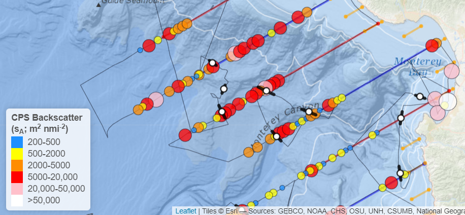
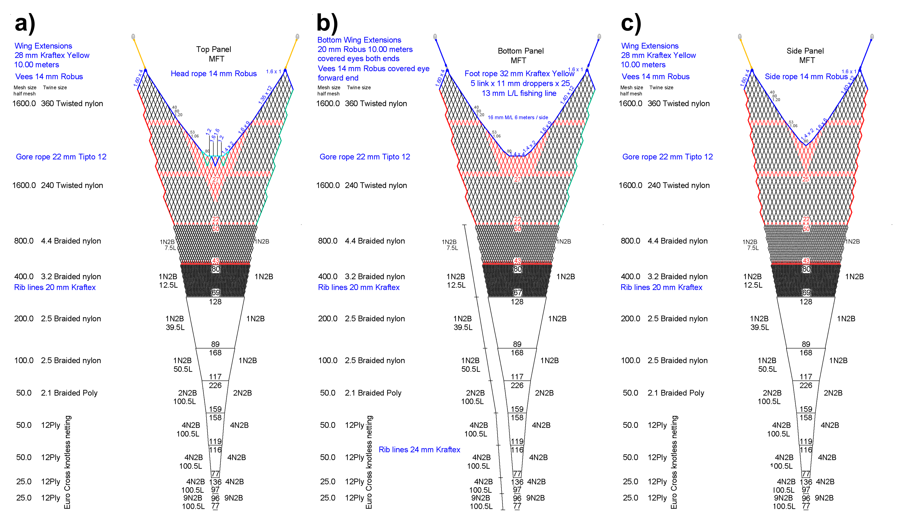
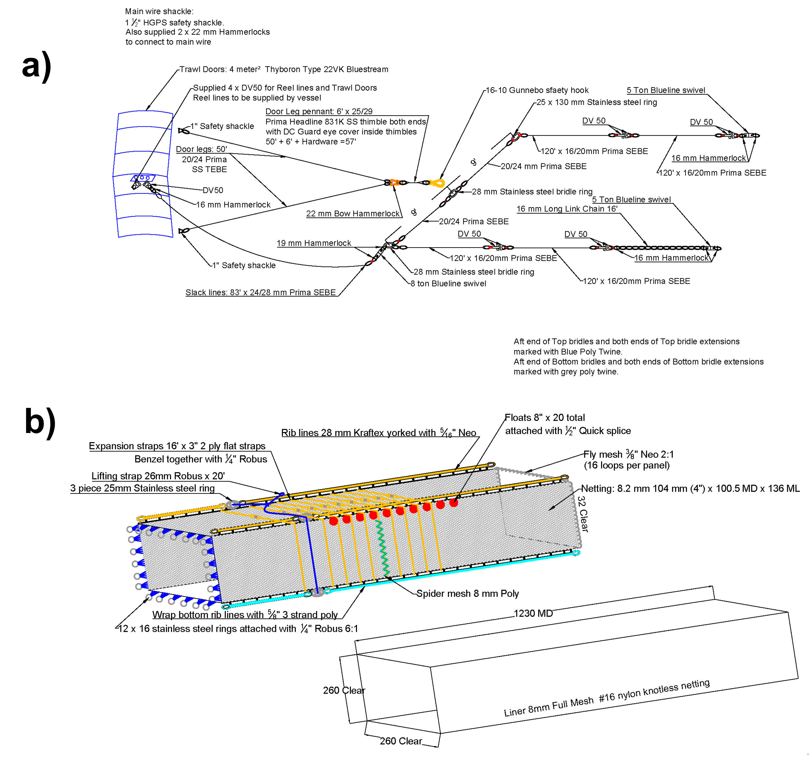

```{r load-libraries,echo=F,error=F,message=F,warning=F}
# Install and load pacman (library management package)
if (!require("pacman")) install.packages("pacman")

# Install and load required packages from CRAN ---------------------------------
pacman::p_load(tidyverse,grid,gridExtra,pander,flextable,lubridate, knitr,here,
               png,devtools,kableExtra,forcats,jpeg,bookdown,bookdownplus,magick,
               mapview,gt)

# Install and load required packages from Github -------------------------------
# surveyR
pacman::p_load_gh("kstierhoff/surveyR")

# set system time zone to UTC
Sys.setenv(tz = "UTC")

# determines method of table generation (whether kable or xtable) for best formatting
doc.type <- knitr::opts_knit$get('rmarkdown.pandoc.to')
if (is.null(doc.type)) {doc.type <- "html"}

# global knitr chunk options
knitr::opts_chunk$set(echo = F, warning = F, message = F,
                      knitr.kable.NA = "-",
                      # fig.align = "center",
                      dev = "png", dev.args = list(type = "cairo"))

# Set options for NA values in knitr::kable
options(knitr.kable.NA = '-')

# determine global knitr table format
if (doc.type == "latex") {
  knitr.format <- "latex"
} else {
  knitr.format <- "html" 
}

# global pander options
panderOptions('table.style','rmarkdown'); panderOptions('table.split.table', Inf); panderOptions('digits', 6);
panderOptions('round', 6); panderOptions('keep.trailing.zeros', T); panderOptions('missing', "")

# output options
png.res       <- 150 # dpi for saved PNG images (to reduce file size while at sea)
```

```{r user-input}
# Combine survey regions? -----------------------------------------------------
# Get project name from directory
prj.name <- last(unlist(str_split(here(),"/")))

# Survey information files ------------------------------------------------------
settings.files <- dir(here("Doc/settings"))
prj.settings <- settings.files[str_detect(settings.files, paste0("settings_", prj.name, ".R"))]
source(here("Doc/settings", prj.settings))

# Output files ------------------------------------------------------------------
prj.output <- settings.files[str_detect(settings.files, paste0("output_", prj.name, ".R"))]
source(here("Doc/settings", prj.output))
```

```{r}
# Summarise survey distance (nmi) by vessel
dist.summ <- nasc.summ %>%
  mutate(vessel = case_when(
    str_detect(transect.name, "RL") ~ "RL",
    str_detect(transect.name, "SD") ~ "SD",
    str_detect(transect.name, "LM") ~ "LM",
    TRUE ~ "Other")) %>% 
  group_by(vessel) %>% 
  summarise(distance = round(sum(distance)))
```

# Background  

## Acoustic-Trawl Method (ATM) Surveys of CPS

* Since 2006, the SWFSC has conducted ATM surveys for coastal pelagic fish species (CPS) in the California Current Ecosystem (CCE)
    + Spring, Summer, or both
* Initially designed to estimate Pacific Sardine biomass
* Subsequently, expanded to span much of the potential distributions of Northern Anchovy, Pacific Mackerel, Jack Mackerel, and Pacific Herring, as time allowed
* Provide abundance, biomass, and size structure for each species for the areas and periods surveyed to inform assessments  

## Pacific Sardine | Habitat distribution

:::::: {.columns}
::: {.column width="50%"}
{width=100%}
:::

::: {.column width="50%"}
<!-- {width=100%} -->
:::
:::::: 

## estimATM: Automated planning, analysis, and reporting  

## Survey Design and Plan  

:::::: {.columns}
::: {.column width="80%"}

Acoustic transects perpendicular to shore in the **"Core"** area

- `r survey.landmark.n` to `r survey.landmark.s` 
- Shallowest depth west to 35 nmi or 1000 fm isobath, whichever is greatest
- **<span style="color:black">Compulsory</span>** (spaced 10 nmi)

Expansion of core survey region

- **<span style="color:magenta">Nearshore</span>** (spaced 5-7 nmi)

:::

::: {.column width="20%"}
{width=100%}
:::
::::::  

## Sampling methods  

:::::: {.columns}
::: {.column width="80%"}

Daytime acoustic sampling

- Nominal speed of 10 kn
- Six echosounder frequencies
  - 18, 38, 70, 120, 200, and 333 kHz

Nighttime trawl sampling

- Up to 3 surface trawls/night in areas where backscatter present
- Nightly trawls clustered to apportion backscatter by species
- In nearshore, purse seine sampling 

Continuous underway fish egg sampling (CUFES)

UCTD/CTD sampling

:::

::: {.column width="20%"}
{width=100%}
:::
::::::

## Survey vessels  

{width=100%}

## Trawl sampling gear  

:::::: {.columns}
::: {.column width="80%"}

Multifunction Trawl Net System (MFT)

- 30 m x 20 m opening (600 m^2^) **[Update]**
- Marine Mammal Excluder Device (MMED)
- Towed at the surface for 30 min at 3.5-4.5 kn

:::

::: {.column width="20%"}
{width=100%}
:::
::::::

## Trawl sampling gear  

:::::: {.columns}
::: {.column width="80%"}

Multifunction Trawl Net System (MFT)

- 30 m x 20 m opening (600 m^2^) **[Update]**
- Marine Mammal Excluder Device (MMED)
- Towed at the surface for 30 min at 3.5-4.5 kn

:::

::: {.column width="20%"}
{width=100%}
:::
::::::

## Sampling effort 

```{r}
sampling.das <- n_distinct(c(unique(date(nasc.summ$start)), unique(date(nasc.summ$end))))
```
:::::: {.columns}
::: {.column width="80%"}

Spanned west coast from `r survey.landmark.n` to `r survey.landmark.s` during `r survey.das` DAS  

Sampled at 10 nmi spacing between Cape Flattery to San Diego  

Sampling summary

- `r sampling.das` acoustic sampling days between `r format(ymd(erddap.survey.start),"%d %B")` and `r format(ymd(erddap.survey.end),"%d %B %Y")`
- `r sum(str_detect(nasc.summ$transect.name, survey.vessel.primary))` (_`r survey.vessel`_) acoustic transects
- 174 nighttime trawl samples
- 201 UCTDs and UCTDs

:::

::: {.column width="20%"}


:::
::::::

## Target strength calculations

The following equations for $TS_{38\mathrm{kHz}}$ were used in this analysis:  

<br>

$\text{P. Sardine: } TS_{\mathrm{38kHz}} = -14.90 \times \log_{10} (L_T) - 13.21$

$\text{P. Herring: }TS_{\mathrm{38kHz}} = -11.97 \times \log_{10} (L_T) - 11.58561$

$\text{N. Anchovy: }TS_{\mathrm{38kHz}} = -13.87 \times \log_{10} (L_T) - 11.797$

$\text{Mackerels: } TS_{\mathrm{38kHz}} = -15.44 \times \log_{10} (L_T) - 7.75$  

<br>

where the units for total length ($L_T$) is cm and $TS$ is dB re 1 m^2^ kg^-1^.

## Post-stratification


## Post-stratification

:::::: {.columns}
::: {.column width="40%"}

- a) Acoustic interval cluster assignment
- b) Proportion of CPS in trawl clusters

:::

::: {.column width="60%"}

{width=100%}

:::
::::::

## Backscatter and Acoustic Proportion in Trawls

{width=100%}

# Results

# All CPS

```{r be-all-format}
# Combine stratum-level biomass estimates for core and nearshore regions (combo)
be <- be %>% mutate(Region = "Core") 

# be.ns <- be.ns %>% mutate(Region = "Nearshore") 

be.combo <- be %>% 
# be.combo <- bind_rows(be, be.ns) %>% 
 arrange(Species, Stock, Region, Stratum) %>% 
 select(Species, Stock, Region, Stratum, everything(), -biomass.sd)

be.all.summ <- be.all.summ %>% 
  mutate(Region = "All", .before = Area) %>% 
  select(-biomass.sd) 

# Rename columns for flextable objects
names(be.combo) <- c("Species","Stock","Region","Number","Area","Transects","Distance","Clusters",
                      "Individuals","Mean","CI (Lower)","CI (Upper)","CV")

names(be.all.summ) <- c("Species","Stock","Region","Area","Transects","Distance","Clusters",
                        "Individuals","Mean","CI (Lower)","CI (Upper)","CV")
```

## All CPS | All Strata (Core)

```{r biomass-all-strata}
num_keys <- c("Area","Distance","Individuals","Mean","CI (Lower)","CI (Upper)","CV")

be.combo %>% 
  filter(Region == "Core") %>% 
  regulartable() %>% 
  add_header(Species  = "",
             Stock    = "",
             Number   = "Stratum", Area = "Stratum", Transects = "Stratum", Distance = "Stratum",
             Clusters = "Trawl", Individuals = "Trawl",
             Mean     = "Biomass", "CI (Lower)" = "Biomass", "CI (Upper)" = "Biomass",
             CV       = "Biomass") %>%  
  merge_h(part = "header") %>%
  merge_v(j = c("Species")) %>%
  theme_box() %>%
  # Format cells
  colformat_double(j = num_keys, big.mark = ",", digits = 0, na_str = "-") %>%
  italic(j = "Species") %>%
  bold(~ Number == "All", bold = TRUE) %>%
  bold(j = c("Mean", "CV")) %>%
  bg(j = "Mean", bg = c("yellow")) %>%
  bg(bg = c("#0691C9"), part = "header") %>% 
  bg(bg = c("#D0ECFA"), ~ Number == "All") %>%
  color(color = "white", part = "header") %>% 
  align(align = "center", part = "header") %>%
  autofit()
```

## All CPS | All Strata (Nearshore)

```{r biomass-all-strata-ns}
num_keys <- c("Area","Distance","Individuals","Mean","CI (Lower)","CI (Upper)", "CV")

be.combo %>% 
  filter(Region == "Nearshore") %>% 
  regulartable() %>% 
  add_header(Species  = "",
             Stock    = "",
             Number   = "Stratum", Area = "Stratum", Transects = "Stratum", Distance = "Stratum",
             Clusters = "Trawl", Individuals = "Trawl",
             Mean     = "Biomass", "CI (Lower)" = "Biomass", "CI (Upper)" = "Biomass",
             CV       = "Biomass") %>%  
  merge_h(part = "header") %>%
  merge_v(j = c("Species")) %>%
  theme_box() %>%
  # Format cells
  colformat_double(j = num_keys, big.mark = ",", digits = 0, na_str = "-") %>%
  italic(j = "Species") %>%
  bold(~ Number == "All", bold = TRUE) %>%
  bold(j = c("Mean", "CV")) %>%
  bg(j = "Mean", bg = c("yellow")) %>%
  bg(bg = c("#0691C9"), part = "header") %>% 
  bg(bg = c("#D0ECFA"), ~ Number == "All") %>%
  color(color = "white", part = "header") %>% 
  align(align = "center", part = "header") %>%
  autofit()
```

## All CPS | Summary (Core + Nearshore)

```{r biomass-summary}
regulartable(be.all.summ) %>%
  add_header(Species  = "",
             Stock    = "",
             Area = "Stratum", Transects = "Stratum", Distance = "Stratum",
             Clusters = "Trawl", Individuals = "Trawl",
             Mean     = "Biomass", "CI (Lower)" = "Biomass", "CI (Upper)" = "Biomass",
             CV = "Biomass") %>% 
  merge_h(part = "header") %>%
  merge_v(j = c("Species")) %>%
  theme_box() %>%
  # Format cells
  colformat_double(j = num_keys, big.mark = ",", digits = 0, na_str = "-") %>%
  italic(j = "Species") %>%
  bold(j = c("Mean", "CV")) %>%
  bg(j = "Mean", bg = c("yellow")) %>%
  bg(bg = c("#0691C9"), part = "header") %>% 
  color(color = "white", part = "header") %>% 
  align(align = "center", part = "header") %>%
  autofit()
```

## Community biomass summary

```{r biomass-time-series-combo}
if (file.exists(here("Figs/fig_biomass_ts_combo.png"))) {
    include_graphics(here("Figs/fig_biomass_ts_combo.png"))  
  } else {
    print("No community biomass time series plot (yet).")
  } 
```

# Northern Anchovy (_Engraulis mordax_)
## N. Anchovy | Northern stock - Biomass

```{r biomass-anch-n}
be.combo %>% 
  filter(Species == "Engraulis mordax", Stock == "Northern", Number == "All") %>% 
  bind_rows(filter(be.all.summ, Species == "Engraulis mordax", Stock == "Northern")) %>% 
  select(-Number) %>% 
  regulartable() %>% 
  add_header(Species  = "",
             Stock    = "",
             Region   = "",
             Area = "Stratum", Transects = "Stratum", Distance = "Stratum",
             Clusters = "Trawl", Individuals = "Trawl",
             Mean     = "Biomass", "CI (Lower)" = "Biomass", "CI (Upper)" = "Biomass",
             CV = "Biomass") %>% 
  merge_h(part = "header") %>%
  merge_v(j = c("Species", "Stock")) %>% 
  theme_box() %>%
  colformat_double(j = num_keys, big.mark = ",", digits = 0, na_str = "-") %>% 
  italic(j = "Species") %>%
  bold(~ Region == "All", bold = TRUE) %>% 
  bg(j = "Mean", bg = c("yellow")) %>%
  bg(bg = c("#0691C9"), part = "header") %>% 
  bg(bg = c("#D0ECFA"), ~ Region == "All") %>%
  color(color = "white", part = "header") %>% 
  align(align = "center", part = "header") %>%
  autofit()
```

## NS N. Anchovy | Biomass and length distribution

:::::: {.columns}
::: {.column width="50%"}  

```{r biom-dens-anch-n,out.height='7.5in',fig.pos='H'}
if (combine.regions) {
  if (file.exists(here("Figs/fig_biomass_dens_combo_Engraulis mordax-Northern.png"))) {
    include_graphics(here("Figs/fig_biomass_dens_combo_Engraulis mordax-Northern.png"))  
  } else {
    print("No results for this species/stock.")
  } 
  
} else {
  if (file.exists(here("Figs/fig_biomass_dens_Engraulis mordax-Northern.png"))) {
    include_graphics(here("Figs/fig_biomass_dens_Engraulis mordax-Northern.png"))  
  } else {
    print("No results for this species/stock.")
  }  
}
```

:::

::: {.column width="50%"}  

```{r l-disagg-anch-n,out.height='6in',fig.pos='H'}
if (combine.regions) {
  if (file.exists(here("Figs/fig_L_disagg_combo_Engraulis mordax-Northern.png"))) {
    include_graphics(here("Figs/fig_L_disagg_combo_Engraulis mordax-Northern.png"))  
  } else {
    print("No results for this species/stock.")
  } 
  
} else {
  if (file.exists(here("Figs/fig_L_disagg_Engraulis mordax-Northern.png"))) {
    include_graphics(here("Figs/fig_L_disagg_Engraulis mordax-Northern.png"))  
  } else {
    print("No results for this species/stock.")
  }
}
```
:::
::::::

## N. Anchovy | Central stock - Biomass

```{r biomass-anch-c}
be.combo %>% 
  filter(Species == "Engraulis mordax", Stock == "Central", Number == "All") %>% 
  bind_rows(filter(be.all.summ, Species == "Engraulis mordax", Stock == "Central")) %>% 
  select(-Number) %>% 
  regulartable() %>% 
  add_header(Species  = "",
             Stock    = "",
             Region   = "",
             Area = "Stratum", Transects = "Stratum", Distance = "Stratum",
             Clusters = "Trawl", Individuals = "Trawl",
             Mean     = "Biomass", "CI (Lower)" = "Biomass", "CI (Upper)" = "Biomass",
             CV = "Biomass") %>% 
  merge_h(part = "header") %>%
  merge_v(j = c("Species", "Stock")) %>% 
  theme_box() %>%
  colformat_double(j = num_keys, big.mark = ",", digits = 0, na_str = "-") %>% 
  italic(j = "Species") %>%
  bold(~ Region == "All", bold = TRUE) %>% 
  bg(j = "Mean", bg = c("yellow")) %>%
  bg(bg = c("#0691C9"), part = "header") %>% 
  bg(bg = c("#D0ECFA"), ~ Region == "All") %>%
  color(color = "white", part = "header") %>% 
  align(align = "center", part = "header") %>%
  autofit()
```

## CS N. Anchovy | Biomass and length distribution

:::::: {.columns}
::: {.column width="50%"}  

```{r biom-dens-anch-c,out.height='7.5in',fig.pos='H'}
if (combine.regions) {
  if (file.exists(here("Figs/fig_biomass_dens_combo_Engraulis mordax-Central.png"))) {
    include_graphics(here("Figs/fig_biomass_dens_combo_Engraulis mordax-Central.png"))  
  } else {
    print("No results for this species/stock.")
  } 
  
} else {
  if (file.exists(here("Figs/fig_biomass_dens_Engraulis mordax-Central.png"))) {
    include_graphics(here("Figs/fig_biomass_dens_Engraulis mordax-Central.png"))  
  } else {
    print("No results for this species/stock.")
  }  
}
```

:::

::: {.column width="50%"}  

```{r l-disagg-anch-c,out.height='6in',fig.pos='H'}
if (combine.regions) {
  if (file.exists(here("Figs/fig_L_disagg_combo_Engraulis mordax-Central.png"))) {
    include_graphics(here("Figs/fig_L_disagg_combo_Engraulis mordax-Central.png"))  
  } else {
    print("No results for this species/stock.")
  } 
  
} else {
  if (file.exists(here("Figs/fig_L_disagg_Engraulis mordax-Central.png"))) {
    include_graphics(here("Figs/fig_L_disagg_Engraulis mordax-Central.png"))  
  } else {
    print("No results for this species/stock.")
  }
}
```
:::
::::::

## N. Anchovy | % Biomass by Cluster & Length


# Pacific Sardine (_Sardinops sagax_)
## P. Sardine | Northern stock - Biomass

```{r biomass-sar-n}
be.combo %>% 
  filter(Species == "Sardinops sagax", Stock == "Northern", Number == "All") %>% 
  bind_rows(filter(be.all.summ, Species == "Sardinops sagax", Stock == "Northern")) %>% 
  select(-Number) %>% 
  regulartable() %>% 
  add_header(Species  = "",
             Stock    = "",
             Region   = "",
             Area = "Stratum", Transects = "Stratum", Distance = "Stratum",
             Clusters = "Trawl", Individuals = "Trawl",
             Mean     = "Biomass", "CI (Lower)" = "Biomass", "CI (Upper)" = "Biomass",
             CV = "Biomass") %>% 
  merge_h(part = "header") %>%
  merge_v(j = c("Species", "Stock")) %>% 
  theme_box() %>%
  colformat_double(j = num_keys, big.mark = ",", digits = 0, na_str = "-") %>% 
  italic(j = "Species") %>%
  bold(~ Region == "All", bold = TRUE) %>% 
  bg(j = "Mean", bg = c("yellow")) %>%
  bg(bg = c("#0691C9"), part = "header") %>% 
  bg(bg = c("#D0ECFA"), ~ Region == "All") %>%
  color(color = "white", part = "header") %>% 
  align(align = "center", part = "header") %>%
  autofit()
```

## NS P. Sardine | Biomass and length distribution

:::::: {.columns}
::: {.column width="50%"}  

```{r biom-dens-sar-n,out.height='7.5in',fig.pos='H'}
if (combine.regions) {
  if (file.exists(here("Figs/fig_biomass_dens_combo_Sardinops sagax-Northern.png"))) {
    include_graphics(here("Figs/fig_biomass_dens_combo_Sardinops sagax-Northern.png"))  
  } else {
    print("No results for this species/stock.")
  } 
  
} else {
  if (file.exists(here("Figs/fig_biomass_dens_Sardinops sagax-Northern.png"))) {
    include_graphics(here("Figs/fig_biomass_dens_Sardinops sagax-Northern.png"))  
  } else {
    print("No results for this species/stock.")
  }  
}
```

:::

::: {.column width="50%"}  

```{r l-disagg-sar-n,out.height='6in',fig.pos='H'}
if (combine.regions) {
  if (file.exists(here("Figs/fig_L_disagg_combo_Sardinops sagax-Northern.png"))) {
    include_graphics(here("Figs/fig_L_disagg_combo_Sardinops sagax-Northern.png"))  
  } else {
    print("No results for this species/stock.")
  } 
  
} else {
  if (file.exists(here("Figs/fig_L_disagg_Sardinops sagax-Northern.png"))) {
    include_graphics(here("Figs/fig_L_disagg_Sardinops sagax-Northern.png"))  
  } else {
    print("No results for this species/stock.")
  }
}
```
:::
::::::

## P. Sardine | Southern stock - Biomass

```{r biomass-sar-s}
be.combo %>% 
  filter(Species == "Sardinops sagax", Stock == "Southern", Number == "All") %>% 
  bind_rows(filter(be.all.summ, Species == "Sardinops sagax", Stock == "Southern")) %>% 
  select(-Number) %>% 
  regulartable() %>% 
  add_header(Species  = "",
             Stock    = "",
             Region   = "",
             Area = "Stratum", Transects = "Stratum", Distance = "Stratum",
             Clusters = "Trawl", Individuals = "Trawl",
             Mean     = "Biomass", "CI (Lower)" = "Biomass", "CI (Upper)" = "Biomass",
             CV = "Biomass") %>% 
  merge_h(part = "header") %>%
  merge_v(j = c("Species", "Stock")) %>% 
  theme_box() %>%
  colformat_double(j = num_keys, big.mark = ",", digits = 0, na_str = "-") %>% 
  italic(j = "Species") %>%
  bold(~ Region == "All", bold = TRUE) %>% 
  bg(j = "Mean", bg = c("yellow")) %>%
  bg(bg = c("#0691C9"), part = "header") %>% 
  bg(bg = c("#D0ECFA"), ~ Region == "All") %>%
  color(color = "white", part = "header") %>% 
  align(align = "center", part = "header") %>%
  autofit()
```


## SS P. Sardine | Biomass and length distribution

:::::: {.columns}
::: {.column width="50%"}  

```{r biom-dens-sar-s,out.height='7.5in',fig.pos='H'}
if (combine.regions) {
  if (file.exists(here("Figs/fig_biomass_dens_combo_Sardinops sagax-Southern.png"))) {
    include_graphics(here("Figs/fig_biomass_dens_combo_Sardinops sagax-Southern.png"))  
  } else {
    print("No results for this species/stock.")
  } 
  
} else {
  if (file.exists(here("Figs/fig_biomass_dens_Sardinops sagax-Southern.png"))) {
    include_graphics(here("Figs/fig_biomass_dens_Sardinops sagax-Southern.png"))  
  } else {
    print("No results for this species/stock.")
  }  
}
```

:::

::: {.column width="50%"}  

```{r l-disagg-sar-s,out.height='6in',fig.pos='H'}
if (combine.regions) {
  if (file.exists(here("Figs/fig_L_disagg_combo_Sardinops sagax-Southern.png"))) {
    include_graphics(here("Figs/fig_L_disagg_combo_Sardinops sagax-Southern.png"))  
  } else {
    print("No results for this species/stock.")
  } 
  
} else {
  if (file.exists(here("Figs/fig_L_disagg_Sardinops sagax-Southern.png"))) {
    include_graphics(here("Figs/fig_L_disagg_Sardinops sagax-Southern.png"))  
  } else {
    print("No results for this species/stock.")
  }
}
```
:::
::::::

## Pacific Sardine | % Biomass by Cluster & Length


# Pacific Mackerel (_Scomber japonicus_)

## Pacific Mackerel - Biomass

```{r biomass-mack}
be.combo %>% 
  filter(Species == "Scomber japonicus", Stock == "All", Number == "All") %>% 
  bind_rows(filter(be.all.summ, Species == "Scomber japonicus", Stock == "All")) %>% 
  select(-Number) %>% 
  regulartable() %>% 
  add_header(Species  = "",
             Stock    = "",
             Region   = "",
             Area = "Stratum", Transects = "Stratum", Distance = "Stratum",
             Clusters = "Trawl", Individuals = "Trawl",
             Mean     = "Biomass", "CI (Lower)" = "Biomass", "CI (Upper)" = "Biomass",
             CV = "Biomass") %>% 
  merge_h(part = "header") %>%
  merge_v(j = c("Species", "Stock")) %>% 
  theme_box() %>%
  colformat_double(j = num_keys, big.mark = ",", digits = 0, na_str = "-") %>% 
  italic(j = "Species") %>%
  bold(~ Region == "All", bold = TRUE) %>% 
  bg(j = "Mean", bg = c("yellow")) %>%
  bg(bg = c("#0691C9"), part = "header") %>% 
  bg(bg = c("#D0ECFA"), ~ Region == "All") %>%
  color(color = "white", part = "header") %>% 
  align(align = "center", part = "header") %>%
  autofit()
```

## Pacific Mackerel | Biomass and length distribution

:::::: {.columns}
::: {.column width="50%"}  

```{r biom-dens-mack,out.height='7.5in',fig.pos='H'}
if (combine.regions) {
  if (file.exists(here("Figs/fig_biomass_dens_combo_Scomber japonicus-All.png"))) {
    include_graphics(here("Figs/fig_biomass_dens_combo_Scomber japonicus-All.png"))  
  } else {
    print("No results for this species/stock.")
  } 
  
} else {
  if (file.exists(here("Figs/fig_biomass_dens_Scomber japonicus-All.png"))) {
    include_graphics(here("Figs/fig_biomass_dens_Scomber japonicus-All.png"))  
  } else {
    print("No results for this species/stock.")
  }  
}
```

:::

::: {.column width="50%"}  

```{r l-disagg-mack,out.height='6in',fig.pos='H'}
if (combine.regions) {
  if (file.exists(here("Figs/fig_L_disagg_combo_Scomber japonicus-All.png"))) {
    include_graphics(here("Figs/fig_L_disagg_combo_Scomber japonicus-All.png"))  
  } else {
    print("No results for this species/stock.")
  } 
  
} else {
  if (file.exists(here("Figs/fig_L_disagg_Scomber japonicus-All.png"))) {
    include_graphics(here("Figs/fig_L_disagg_Scomber japonicus-All.png"))  
  } else {
    print("No results for this species/stock.")
  }
}
```
:::
::::::

## Pacific Mackerel | % Biomass by Cluster & Length


# Jack Mackerel (_Trachurus symmetricus_)

## Jack Mackerel - Biomass

```{r biomass-jack}
be.combo %>% 
  filter(Species == "Trachurus symmetricus", Stock == "All", Number == "All") %>% 
  bind_rows(filter(be.all.summ, Species == "Trachurus symmetricus", Stock == "All")) %>% 
  select(-Number) %>% 
  regulartable() %>% 
  add_header(Species  = "",
             Stock    = "",
             Region   = "",
             Area = "Stratum", Transects = "Stratum", Distance = "Stratum",
             Clusters = "Trawl", Individuals = "Trawl",
             Mean     = "Biomass", "CI (Lower)" = "Biomass", "CI (Upper)" = "Biomass",
             CV = "Biomass") %>% 
  merge_h(part = "header") %>%
  merge_v(j = c("Species", "Stock")) %>% 
  theme_box() %>%
  colformat_double(j = num_keys, big.mark = ",", digits = 0, na_str = "-") %>% 
  italic(j = "Species") %>%
  bold(~ Region == "All", bold = TRUE) %>% 
  bg(j = "Mean", bg = c("yellow")) %>%
  bg(bg = c("#0691C9"), part = "header") %>% 
  bg(bg = c("#D0ECFA"), ~ Region == "All") %>%
  color(color = "white", part = "header") %>% 
  align(align = "center", part = "header") %>%
  autofit()
```

## Jack Mackerel | Biomass and length distribution

:::::: {.columns}
::: {.column width="50%"}  

```{r biom-dens-jack,out.height='7.5in',fig.pos='H'}
if (combine.regions) {
  if (file.exists(here("Figs/fig_biomass_dens_combo_Trachurus symmetricus-All.png"))) {
    include_graphics(here("Figs/fig_biomass_dens_combo_Trachurus symmetricus-All.png"))  
  } else {
    print("No results for this species/stock.")
  } 
  
} else {
  if (file.exists(here("Figs/fig_biomass_dens_Trachurus symmetricus-All.png"))) {
    include_graphics(here("Figs/fig_biomass_dens_Trachurus symmetricus-All.png"))  
  } else {
    print("No results for this species/stock.")
  }  
}
```

:::

::: {.column width="50%"}  

```{r l-disagg-jack,out.height='6in',fig.pos='H'}
if (combine.regions) {
  if (file.exists(here("Figs/fig_L_disagg_combo_Trachurus symmetricus-All.png"))) {
    include_graphics(here("Figs/fig_L_disagg_combo_Trachurus symmetricus-All.png"))  
  } else {
    print("No results for this species/stock.")
  } 
  
} else {
  if (file.exists(here("Figs/fig_L_disagg_Trachurus symmetricus-All.png"))) {
    include_graphics(here("Figs/fig_L_disagg_Trachurus symmetricus-All.png"))  
  } else {
    print("No results for this species/stock.")
  }
}
```
:::
::::::

## Jack Mackerel | % Biomass by Cluster & Length


# Pacific Herring (_Clupea pallasii_)

## Pacific Herring - Biomass

```{r biomass-her}
be.combo %>% 
  filter(Species == "Clupea pallasii", Stock == "All", Number == "All") %>% 
  bind_rows(filter(be.all.summ, Species == "Clupea pallasii", Stock == "All")) %>% 
  select(-Number) %>% 
  regulartable() %>% 
  add_header(Species  = "",
             Stock    = "",
             Region   = "",
             Area = "Stratum", Transects = "Stratum", Distance = "Stratum",
             Clusters = "Trawl", Individuals = "Trawl",
             Mean     = "Biomass", "CI (Lower)" = "Biomass", "CI (Upper)" = "Biomass",
             CV = "Biomass") %>% 
  merge_h(part = "header") %>%
  merge_v(j = c("Species", "Stock")) %>% 
  theme_box() %>%
  colformat_double(j = num_keys, big.mark = ",", digits = 0, na_str = "-") %>% 
  italic(j = "Species") %>%
  bold(~ Region == "All", bold = TRUE) %>% 
  bg(j = "Mean", bg = c("yellow")) %>%
  bg(bg = c("#0691C9"), part = "header") %>% 
  bg(bg = c("#D0ECFA"), ~ Region == "All") %>%
  color(color = "white", part = "header") %>% 
  align(align = "center", part = "header") %>%
  autofit()
```

## Pacific Herring | Biomass and length distribution

:::::: {.columns}
::: {.column width="50%"}  

```{r biom-dens-her,out.height='7.5in',fig.pos='H'}
if (combine.regions) {
  if (file.exists(here("Figs/fig_biomass_dens_combo_Clupea pallasii-All.png"))) {
    include_graphics(here("Figs/fig_biomass_dens_combo_Clupea pallasii-All.png"))  
  } else {
    print("No results for this species/stock.")
  } 
  
} else {
  if (file.exists(here("Figs/fig_biomass_dens_Clupea pallasii-All.png"))) {
    include_graphics(here("Figs/fig_biomass_dens_Clupea pallasii-All.png"))  
  } else {
    print("No results for this species/stock.")
  }  
}
```

:::

::: {.column width="50%"}  

```{r l-disagg-her,out.height='6in',fig.pos='H'}
if (combine.regions) {
  if (file.exists(here("Figs/fig_L_disagg_combo_Clupea pallasii-All.png"))) {
    include_graphics(here("Figs/fig_L_disagg_combo_Clupea pallasii-All.png"))  
  } else {
    print("No results for this species/stock.")
  } 
  
} else {
  if (file.exists(here("Figs/fig_L_disagg_Clupea pallasii-All.png"))) {
    include_graphics(here("Figs/fig_L_disagg_Clupea pallasii-All.png"))  
  } else {
    print("No results for this species/stock.")
  }
}
```
:::
::::::

## Pacific Herring | % Biomass by Cluster & Length


## Useful resources

Flextable 
https://davidgohel.github.io/flextable/articles/overview.html

Rmarkdown in PowerPoint Slides
https://bookdown.org/yihui/rmarkdown/powerpoint-presentation.html
